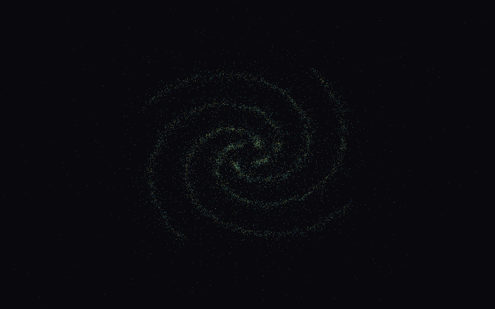

# N-Body Project

Direct gravitational N-body simulation written in C++.

The project compares different implementations of the same physical problem:
serial execution, memory-layout optimization, SIMD vectorization, OpenMP
parallelization and CUDA acceleration. All versions use the same softened
gravitational model and the same Forward Euler time integration.



## What Is Implemented

- 🧱 `SerialAoS`: sequential implementation using Array of Structures.
- 🧩 `SerialSoA`: sequential implementation using Structure of Arrays.
- ⚡ `SIMDSoA`: AVX2 implementation based on the SoA layout.
- 🧵 `OpenMPSoA`: OpenMP implementation parallelizing the outer loop.
- 🚀 `CudaSoA`: CUDA implementation using shared-memory tiling.
- 🌌 OpenGL viewer for trajectory visualization.
- 📊 Benchmark scripts and plots for layout, SIMD, OpenMP and CUDA experiments.

All implementations keep the direct all-pairs formulation, with cost
`O(N^2)` per time step. This makes the comparisons focused on data layout and
parallelization strategy rather than on a different physical or numerical
model.

## Project Structure

```text
.
|-- asset/
|   |-- input/       Example input files
|   |-- output/      Example generated trajectories
|   `-- plots/       Images used by the README
|-- benchmark/
|   |-- scripts/     Scripts used to run the experiments
|   `-- results/     CSV files and generated plots
|-- src/
|   |-- common/
|   |   |-- core/    Bodies, physics, trajectories and solver interface
|   |   |-- ogl/     OpenGL trajectory viewer
|   |   `-- utils/   Command-line parser, timer and partition utilities
|   |-- nbody/
|   |   |-- serial/  Serial AoS and SoA solvers
|   |   |-- simd/    AVX2 SIMD solver
|   |   |-- openmp/  OpenMP solver
|   |   |-- cuda/    CUDA solver
|   |   `-- main.cpp Common executable entry point
|   `-- test/        Correctness and comparison tests
`-- CMakeLists.txt
```

The common structure is intentional. Each solver changes the implementation of
the acceleration computation, while the time update is performed through the
shared `updatePositionsAndVelocities()` method. This keeps the numerical scheme
identical across versions.

## Initial Conditions

The initial state can be generated automatically with `--scheme`.

- 🌌 `galaxy`: disk of orbiting bodies around a central massive body.
- 🌀 `spiral`: four-arm spiral distribution, useful for visualization.
- ⭕ `circular`: regular circular configuration, useful for small checks.

An external input file can also be passed with `--input`.

## Requirements

Required:

- CMake 3.20 or newer.
- C++20 compiler.
- OpenMP support for the default build.

Optional:

- x86-64 CPU with AVX2 and FMA support for `SIMDSoA`.
- CUDA Toolkit and NVIDIA GPU for `CudaSoA`.
- OpenGL and GLFW for the viewer.

CUDA cannot be executed on Apple Silicon. The CUDA code can stay in the project,
but it must be built and tested on a Linux machine with an NVIDIA GPU.

## Build

Standard build:

```bash
cmake -S . -B build -DCMAKE_BUILD_TYPE=Release
cmake --build build
```

On macOS with Apple Silicon, AVX2 must be disabled:

```bash
cmake -S . -B build -DCMAKE_BUILD_TYPE=Release \
    -DNBODY_ENABLE_AVX2=OFF
cmake --build build
```

If OpenMP is installed through Homebrew LLVM:

```bash
cmake -S . -B build -DCMAKE_BUILD_TYPE=Release \
    -DCMAKE_CXX_COMPILER=/opt/homebrew/opt/llvm/bin/clang++ \
    -DNBODY_ENABLE_AVX2=OFF
cmake --build build
```

CUDA build on Linux:

```bash
cmake -S . -B build-cuda -DCMAKE_BUILD_TYPE=Release \
    -DNBODY_ENABLE_CUDA=ON
cmake --build build-cuda
```

Viewer build:

```bash
cmake -S . -B build-viewer -DCMAKE_BUILD_TYPE=Release \
    -DNBODY_ENABLE_OPENGL=ON \
    -DNBODY_ENABLE_AVX2=OFF
cmake --build build-viewer --target nbody_viewer
```

## Run the Simulation

Main executable:

```bash
./build/nbody [options]
```

Main options:

```text
--implementation serial-aos|serial-soa|simd|openmp|cuda
--scheme galaxy|spiral|circular
--bodies N
--steps N
--dt VALUE
--g VALUE
--softening VALUE
--input PATH
--output PATH
--no-output
```

Use `--no-output` for timing runs. Use `--output` when a trajectory is needed
for the viewer.

### Serial AoS

```bash
./build/nbody --implementation serial-aos \
    --scheme galaxy --bodies 1000 --steps 100 --dt 0.001 \
    --output asset/output/galaxy.csv
```

### Serial SoA

```bash
./build/nbody --implementation serial-soa \
    --scheme galaxy --bodies 1000 --steps 100 --dt 0.001 \
    --output asset/output/galaxy.csv
```

### SIMD SoA

```bash
./build/nbody --implementation simd \
    --scheme spiral --bodies 1024 --steps 100 --dt 0.001 \
    --no-output
```

`SIMDSoA` uses AVX2 registers with four `double` values. Therefore, the number
of bodies must be divisible by four.

### OpenMP SoA

```bash
OMP_NUM_THREADS=4 ./build/nbody --implementation openmp \
    --scheme spiral --bodies 4096 --steps 100 --dt 0.001 \
    --no-output
```

The OpenMP solver parallelizes the outer loop of the acceleration computation.
The schedule is selected at runtime, so experiments can also use:

```bash
OMP_NUM_THREADS=4 OMP_SCHEDULE=static ./build/nbody --implementation openmp \
    --scheme spiral --bodies 4096 --steps 100 --dt 0.001 \
    --no-output
```

### CUDA SoA

```bash
./build-cuda/nbody --implementation cuda \
    --scheme spiral --bodies 4096 --steps 100 --dt 0.001 \
    --no-output
```

The CUDA solver assigns one body to each GPU thread. Source bodies are loaded
tile by tile into shared memory and reused by all threads in the block.

## Visualize a Trajectory

Generate a trajectory:

```bash
./build/nbody --implementation serial-aos \
    --scheme spiral --bodies 3000 --steps 1000 --dt 0.001 \
    --output asset/output/spiral_view.csv
```

Open it:

```bash
./build-viewer/nbody_viewer asset/output/spiral_view.csv
```

Viewer controls:

- 🖱️ left mouse drag: rotate the scene.
- 🔍 mouse wheel: zoom in and out.
- ⎋ `Escape`: close the window.

Body colors are computed from their speed, while body size uses the stored
radius field.

## Input and Output Format

Input files contain one body per line:

```text
mass position_x position_y position_z velocity_x velocity_y velocity_z
```

Lines beginning with `#` are ignored. The radius is assigned automatically when
reading this format.

Trajectory CSV files contain:

```text
step,time,id,mass,x,y,z,vx,vy,vz,radius
```

A frame is written at the initial state and after every integration step.

## Tests

Run the CPU tests:

```bash
ctest --test-dir build --output-on-failure
```

Run CUDA tests after a CUDA build:

```bash
ctest --test-dir build-cuda --output-on-failure
```

The tests compare the main implementations against the serial reference over
short integrations.

## Benchmarks

Benchmark scripts are located in `benchmark/scripts/`.

Examples:

```bash
./benchmark/scripts/run_layout.sh
./benchmark/scripts/run_simd.sh
./benchmark/scripts/run_openmp_scaling.sh
```

CUDA benchmarks, to be run on a Linux machine with an NVIDIA GPU:

```bash
./benchmark/scripts/run_cuda_comparison.sh
./benchmark/scripts/run_cuda_blocksize.sh
```

The generated CSV files and plots are stored in `benchmark/results/`.

## Suggested Runs

Quick visual run:

```bash
./build/nbody --implementation serial-aos \
    --scheme spiral --bodies 1000 --steps 600 --dt 0.001 \
    --output asset/output/spiral_1000.csv

./build-viewer/nbody_viewer asset/output/spiral_1000.csv
```

Longer visual run:

```bash
./build/nbody --implementation openmp \
    --scheme spiral --bodies 3000 --steps 1500 --dt 0.001 \
    --output asset/output/spiral_3000.csv

./build-viewer/nbody_viewer asset/output/spiral_3000.csv
```

Timing-only OpenMP run:

```bash
OMP_NUM_THREADS=8 ./build/nbody --implementation openmp \
    --scheme spiral --bodies 8192 --steps 100 --dt 0.001 \
    --no-output
```
